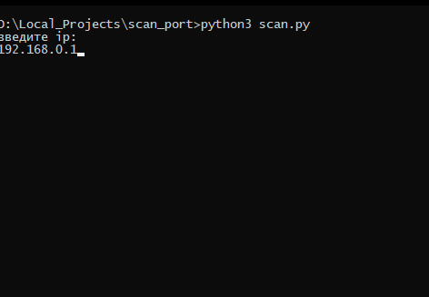

# Scan port
### is simple console app for scan you network

#### Step one(How run)

#### Step two(Input ip)

#### Step three (Waiting for love) :)

#### Result

Plan of work 

## Update 28.12.2019:
+ добавлено время сканирования портов
